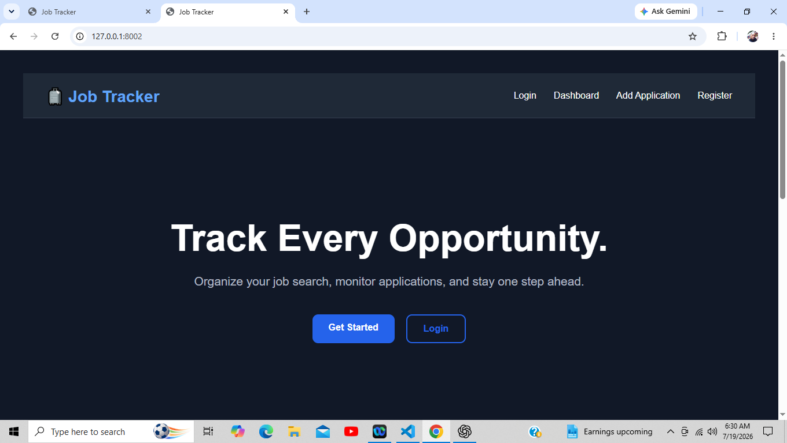
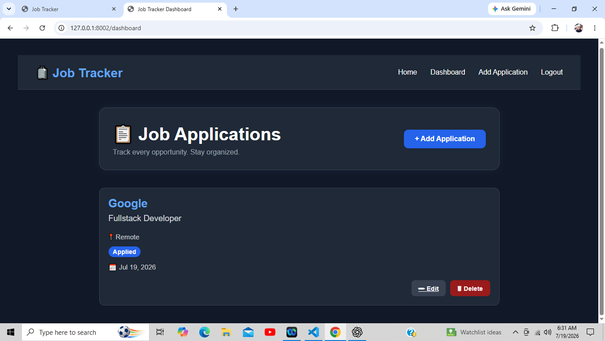
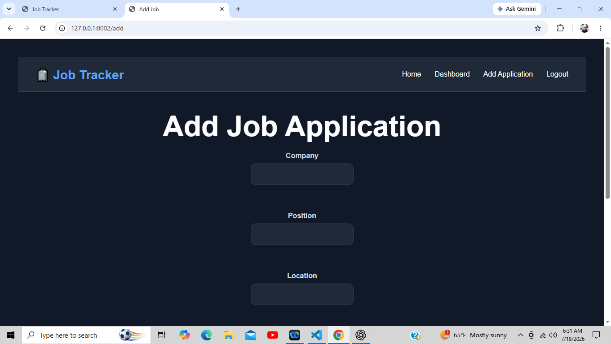
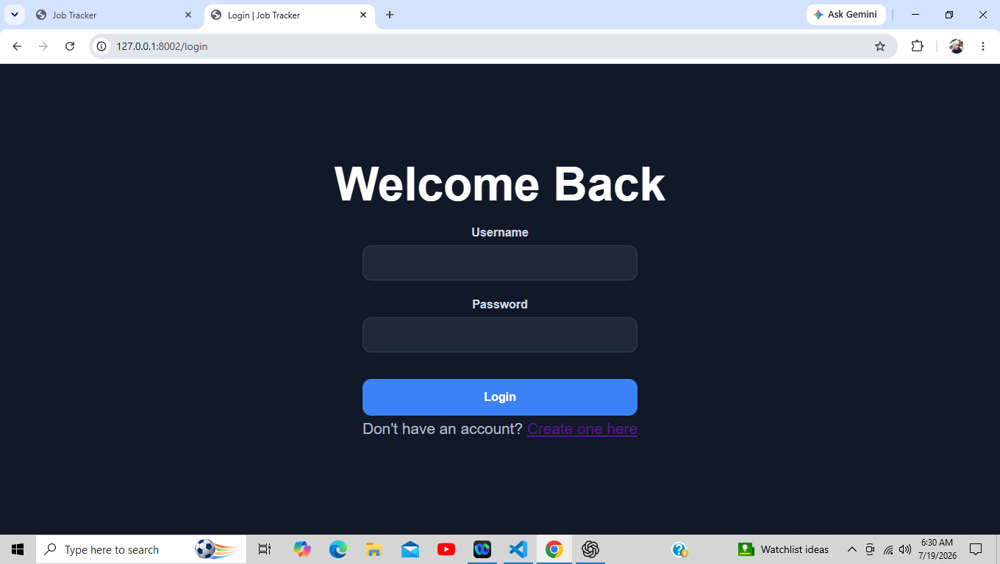
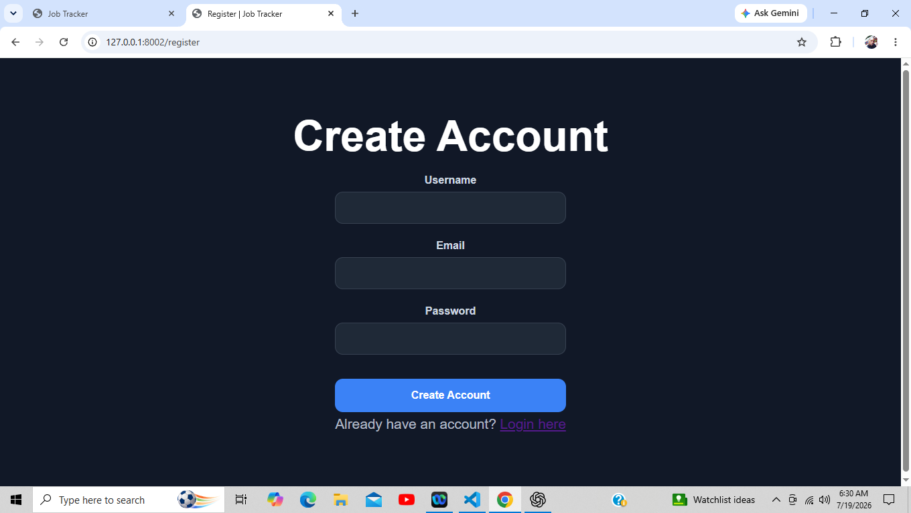
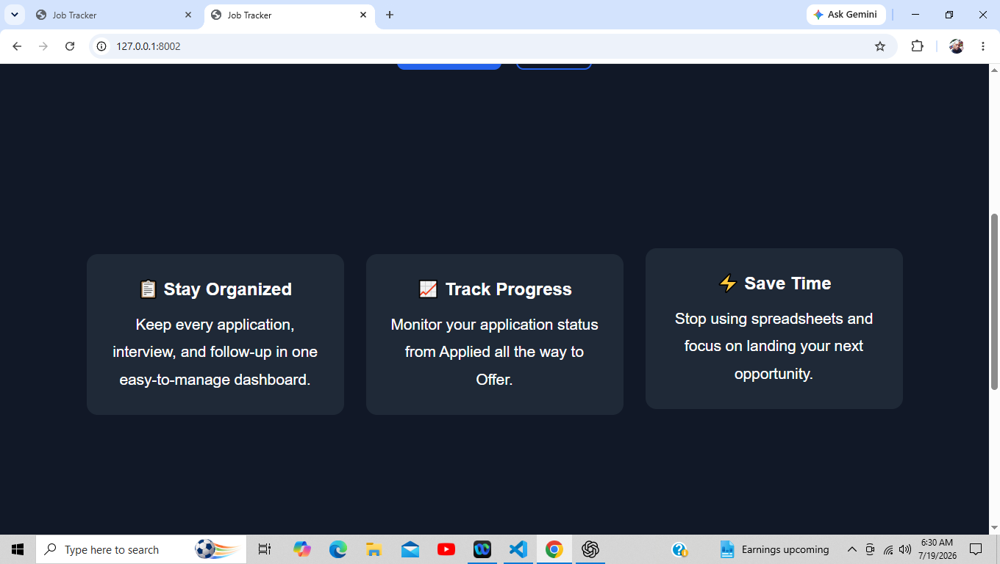
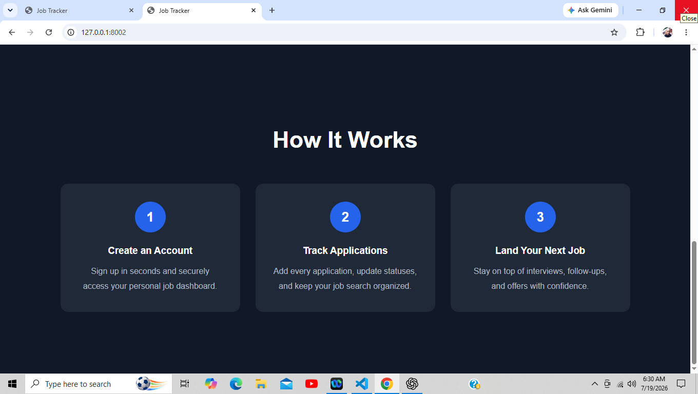

# Job Tracker

A full-stack Job Tracker built with **FastAPI, SQLAlchemy, SQLite, Jinja2, HTML, and CSS**.

This project demonstrates backend development skills by building a secure multi-user CRUD application with authentication, session management, and database relationships.

---

## Preview



---

## Features

### Authentication & Security
- ✅ User Registration
- ✅ Secure Password Hashing (bcrypt)
- ✅ User Login
- ✅ Session Authentication
- ✅ Logout
- ✅ Protected Routes
- ✅ User Authorization (Users can only access their own applications)

### Job Applications
- ✅ Dashboard
- ✅ Create Application
- ✅ Edit Application
- ✅ Delete Application
- ✅ Applications linked to the logged-in user

### Database
- ✅ SQLite
- ✅ SQLAlchemy ORM
- ✅ One-to-Many Relationship (User → Applications)
- ✅ Automatic Table Creation

### User Experience
- ✅ Dashboard after Login
- ✅ Redirect after Creating an Application
- ✅ Redirect after Editing an Application
- ✅ Redirect after Deleting an Application
- ✅ Responsive Design

---

## Technologies

- Python
- FastAPI
- SQLAlchemy
- SQLite
- Jinja2
- HTML5
- CSS3
- Passlib (bcrypt)
- Starlette Sessions
- Python-dotenv

---

## Installation

Clone the repository:

```bash
git clone https://github.com/Unique86/job-tracker.git
```

Navigate into the project:

```bash
cd job-tracker
```

Create a virtual environment:

```bash
python -m venv venv
```

Activate the virtual environment.

### Windows

```bash
venv\Scripts\activate
```

### Linux / macOS

```bash
source venv/bin/activate
```

Install the dependencies:

```bash
pip install -r requirements.txt
```

Create a `.env` file in the project root:

```text
SECRET_KEY=your_secret_key_here
```

Run the application:

```bash
uvicorn app.main:app --reload
```

Open your browser and visit:

```
http://127.0.0.1:8000
```

---

## Usage

1. Register a new account.
2. Log in securely.
3. Add job applications.
4. Edit existing applications.
5. Delete applications.
6. Track your job search from your personal dashboard.

---

## Planned Features

### Dashboard
- [ ] Statistics Cards
  - Total Applications
  - Interviews
  - Offers
  - Rejections

### Search & Filtering
- [ ] Search by Company
- [ ] Filter by Status
- [ ] Sort by Date

### User Experience
- [ ] Status Badges
- [ ] Better Dashboard Layout
- [ ] Success & Error Messages
- [ ] Delete Confirmation Dialog

### Future Versions
- [ ] Resume Upload
- [ ] Cover Letter Storage
- [ ] Interview Notes
- [ ] Email Reminders
- [ ] Analytics Dashboard

---

## What I Learned

This project helped me gain experience with:

- Building RESTful web applications using FastAPI
- SQLAlchemy ORM and database relationships
- User authentication and secure password hashing
- Session-based authentication
- Route protection and authorization
- CRUD operations
- Organizing larger FastAPI projects
- Refactoring duplicated code into reusable helpers
- Writing cleaner, production-ready code

---

## Screenshots

### Landing Page


### Dashboard



### Add Application



### Login



### Register



### Features



### How It Works



---

## License

MIT

---

## Version

**Current Release:** v1.0.0